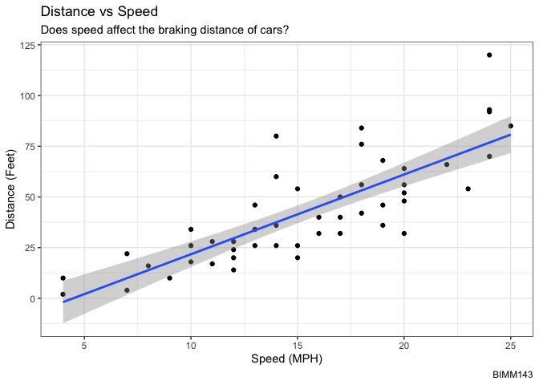
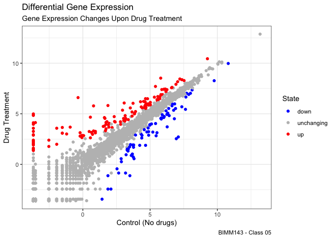

Class05: Data Visualization with GGPLOT
================
AnelGarcia
4/19/23

# Base R Plotting

We are going to start by generating the plot of class 04. This code is
plotting the cars dataset.

``` r
plot(cars)
```


## GgPlot2

``` r
#install.packages('ggplot2')
```

After that, we need to load the package.

``` r
library(ggplot2)
```

We are going to build the plots of cars dataframe by using ggplot2.

``` r
ggplot(data = cars)
```


``` r
ggplot(data = cars) + 
  aes(x=speed, y=dist)
```


``` r
ggplot(data = cars) + 
  aes(x=speed, y=dist) + 
  geom_point()
```


``` r
ggplot(data = cars) + 
  aes(x=speed, y=dist) + 
  geom_point() + 
  geom_smooth(method = 'lm') + 
  labs(title = 'Distance vs Speed', 
       subtitle = "Does speed affect the braking distance of cars?", 
       caption = 'BIMM143', 
       x = 'Speed (MPH)', 
       y = 'Distance (Feet)') + 
  theme_bw()
```

    `geom_smooth()` using formula = 'y ~ x'



**Q1.** For which phases is data visualization important in our
scientific workflows?

For communication of results, detection of outliers and Exploratory Data
Analysis (EDA)

**Q2.** True or False? The ggplot2 package comes already installed with
R?

FALSE, we have to install the ggplot2 package

**Q3.** Which plot types are typically NOT used to compare distributions
of numeric variables?

Network graphs

**Q4.** Which statement about data visualization with ggplot2 is
incorrect?

ggplot2 is the only way to create plots in R

**Q5.** Which geometric layer should be used to create scatter plots in
ggplot2?

geom_point()

**Q6.** In your own RStudio can you add a trend line layer to help show
the relationship between the plot variables with
the `geom_smooth()` function?

Yes,

ggplot(data = cars) + aes(x=speed, y=dist) + geom_point() + +
geom_smooth()

**Q7.** Argue with `geom_smooth()` to add a straight line from a linear
model without the shaded standard error region?

Yes

ggplot(cars) + aes(x=speed, y=dist) + geom_point() +
geom_smooth(method=“lm”, se=FALSE)

**Q8.** Can you finish this plot by adding various label annotations
with the `labs()` function and changing the plot look to a more
conservative “black & white” theme by adding the `theme_bw()`function:

Yes,

ggplot(data = cars) + aes(x=speed, y=dist) + geom_point() +
geom_smooth(method = ‘lm’) + labs(title = ‘Distance vs Speed’, subtitle
= “Does speed affect the braking distance of cars?”, caption =
‘BIMM143’, x = ‘Speed (MPH)’, y = ‘Distance (Feet)’) + theme_bw()

### Plotting Gene Expression Data

``` r
url <- "https://bioboot.github.io/bimm143_S20/class-material/up_down_expression.txt"
genes <- read.delim(url)
head(genes)
```

            Gene Condition1 Condition2      State
    1      A4GNT -3.6808610 -3.4401355 unchanging
    2       AAAS  4.5479580  4.3864126 unchanging
    3      AASDH  3.7190695  3.4787276 unchanging
    4       AATF  5.0784720  5.0151916 unchanging
    5       AATK  0.4711421  0.5598642 unchanging
    6 AB015752.4 -3.6808610 -3.5921390 unchanging

Intitial ggplot

**Q13.**

``` r
ggplot(data = genes) + 
  aes(x=Condition1, y=Condition2) + 
  geom_point()
```


**Q9-12.**

``` r
nrow(genes)
```

    [1] 5196

The number of genes in the dataframe is 5,196.

``` r
ncol(genes)
```

    [1] 4

The number of columns in the genes dataframe.

``` r
colnames(genes)
```

    [1] "Gene"       "Condition1" "Condition2" "State"     

The name of the columns on the genes dataframe.

``` r
table(genes[,'State'])
```


          down unchanging         up 
            72       4997        127 

We use the table() function to find the number of ‘up’ regulated genes.

``` r
round(table(genes$State)/nrow(genes) * 100, 2)
```


          down unchanging         up 
          1.39      96.17       2.44 

We are finding the fraction of total genes that are up-regulated in the
dataset by using the summary table and dividing it by the number of
rows. We then multiplied the answer by 100, and rounded the final answer
to 2 significant figures.

Adding color to the plot

``` r
ggplot(data = genes) + 
  aes(x=Condition1, y=Condition2, col=State) + 
  geom_point()
```


``` r
p1 <- ggplot(data = genes) + 
  aes(x=Condition1, y=Condition2, col=State) + 
  geom_point()

p1
```


Let’s change the color scheme.

``` r
p1 + scale_colour_manual(values = c('blue', 'gray', 'red'))
```


``` r
p2 <- p1 + scale_colour_manual(values = c('blue', 'gray', 'red'))

p2
```


**Q14.**

``` r
p2 + labs(title = 'Differential Gene Expression', 
       subtitle = 'Gene Expression Changes Upon Drug Treatment', 
       caption = 'BIMM143 - Class 05', 
       x = 'Control (No drugs)', 
       y = 'Drug Treatment') +
  theme_bw()
```


