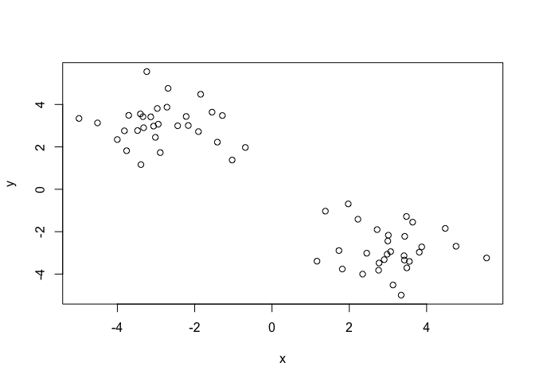
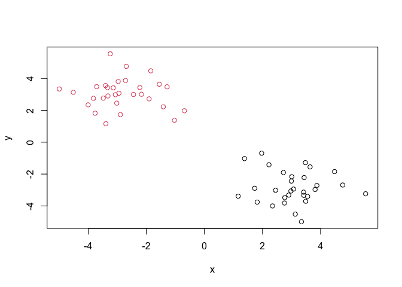
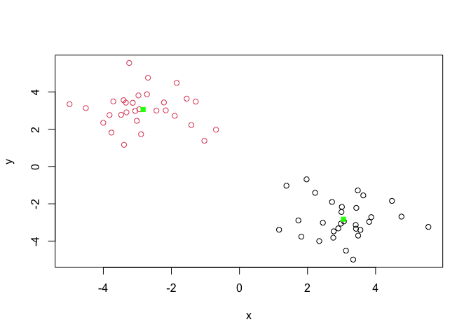
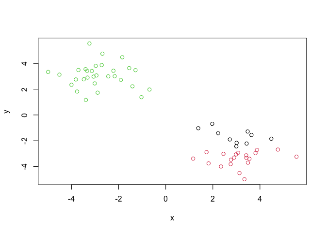
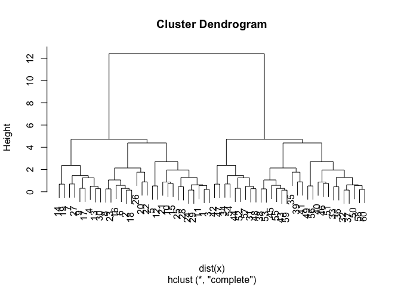
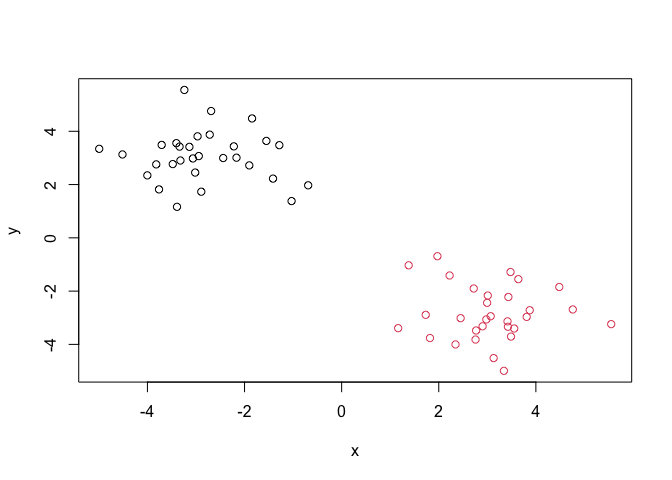
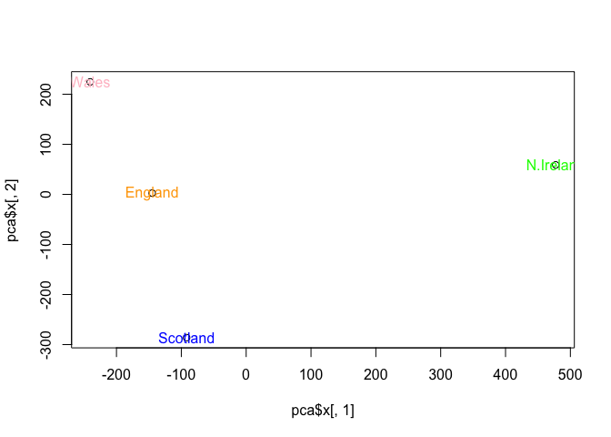
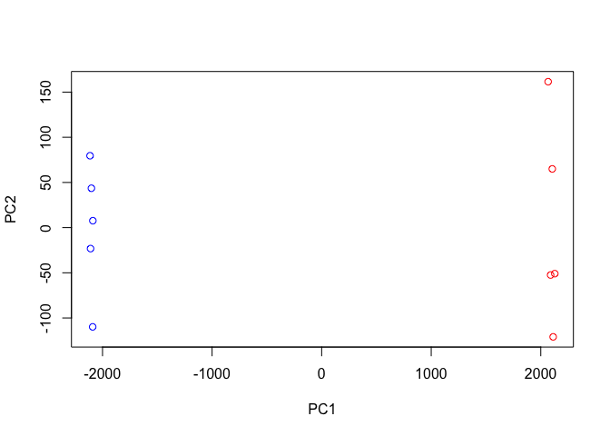
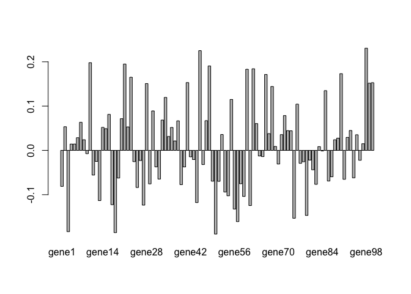

Class07
================
Anel Garcia
4/26/23

## Example of K-means clustering

First step is to make up some data with a known structure, so we know
what the answer should be.

``` r
tmp <- c( rnorm(30, mean = -3), rnorm(30, mean = 3))

tmp
```

     [1] -3.3205175 -3.4037853 -3.4781334 -2.2203752 -4.9932765 -3.1358192
     [7] -1.9022519 -2.7170994 -1.5508137 -3.7615564 -3.0162561 -4.5139478
    [13] -2.1658935 -0.6895061 -3.3908837 -3.7065584 -1.2837395 -3.3385751
    [19] -1.0311752 -2.6884647 -2.8909205 -1.8452669 -2.9677740 -3.0633302
    [25] -3.8185714 -3.2396012 -1.4133397 -4.0018419 -2.9422694 -2.4399926
    [31]  2.9961604  3.0693981  2.3448227  2.2231770  5.5514082  2.7575249
    [37]  2.9799285  3.8106307  4.4816916  1.7313741  4.7603615  1.3803657
    [43]  3.4246028  3.4781055  3.4881841  1.1637686  1.9721035  3.0091014
    [49]  3.1304076  2.4504623  1.8188003  3.6388715  3.8734637  2.7198492
    [55]  3.4158663  3.3415744  3.4336206  2.7690168  3.5539643  2.9029736

``` r
x <- cbind(x = tmp, y = rev(tmp))

plot(x)
```



Now we have some structured data in x. Let’s see if k-means is able to
identify the two groups.

``` r
k <- kmeans(x, centers = 2, nstart = 20)

k
```

    K-means clustering with 2 clusters of sizes 30, 30

    Cluster means:
              x         y
    1  3.055719 -2.831051
    2 -2.831051  3.055719

    Clustering vector:
     [1] 2 2 2 2 2 2 2 2 2 2 2 2 2 2 2 2 2 2 2 2 2 2 2 2 2 2 2 2 2 2 1 1 1 1 1 1 1 1
    [39] 1 1 1 1 1 1 1 1 1 1 1 1 1 1 1 1 1 1 1 1 1 1

    Within cluster sum of squares by cluster:
    [1] 56.71458 56.71458
     (between_SS / total_SS =  90.2 %)

    Available components:

    [1] "cluster"      "centers"      "totss"        "withinss"     "tot.withinss"
    [6] "betweenss"    "size"         "iter"         "ifault"      

Let’s explore K:

``` r
#We're exploring the size of k.

k$size
```

    [1] 30 30

``` r
#We're exploring the centers of k.

k$centers
```

              x         y
    1  3.055719 -2.831051
    2 -2.831051  3.055719

``` r
#Now we plot the variable x and the clusters for k (k$clusters)

plot(x, col = k$cluster)
```



``` r
#We're exploring the cluster of k.

k$cluster
```

     [1] 2 2 2 2 2 2 2 2 2 2 2 2 2 2 2 2 2 2 2 2 2 2 2 2 2 2 2 2 2 2 1 1 1 1 1 1 1 1
    [39] 1 1 1 1 1 1 1 1 1 1 1 1 1 1 1 1 1 1 1 1 1 1

Now we can add the clusters centers:

``` r
#Using the plot of variable x and k$clusters

plot(x, col = k$cluster)

# We want to look at points 15 in the centers data.
# To higlight these points we use the function for color col = 'green'
points(k$centers, col = 'green', pch = 15)
```



An example,

``` r
k_3 <- kmeans(x, centers = 3, nstart = 20)

plot(x, col = k_3$cluster)
```



# Example of Hierarchical Clustering

Let’s use the same data as before, which we stored in ‘x’. We will use
the hclust() function.

``` r
# By using the hclust() function we can cluster the data in dist(x).
clustering <- hclust(dist(x))

# Now we check that the new information was stored in clustering.
clustering
```


    Call:
    hclust(d = dist(x))

    Cluster method   : complete 
    Distance         : euclidean 
    Number of objects: 60 

``` r
# We want to plot the clustering data.
plot(clustering)
```



Let’s add a horizontal line

``` r
# Now that we have ploted the clustering data, we want to add a line
plot(clustering)

# We add a line by using the function abline(). However, we have to specify the height (10) and the color of the line ('pink')
abline(h = 10, col = 'pink')
```


To get our results (i.e., membership vector) we need to “cut” the tree.
The function for doing that is cutree().

``` r
# We want to store the vector under subgroup. 
# We also specified that we want a height of 10.
subgroups <- cutree(clustering, h = 10)

# Check that the cutree function was stored in subgroups
subgroups
```

     [1] 1 1 1 1 1 1 1 1 1 1 1 1 1 1 1 1 1 1 1 1 1 1 1 1 1 1 1 1 1 1 2 2 2 2 2 2 2 2
    [39] 2 2 2 2 2 2 2 2 2 2 2 2 2 2 2 2 2 2 2 2 2 2

Plotting this…

``` r
plot(x, col = subgroups)
```



You can also “cut” your tree with the number of clusters you want:

``` r
cutree(clustering, k = 2)
```

     [1] 1 1 1 1 1 1 1 1 1 1 1 1 1 1 1 1 1 1 1 1 1 1 1 1 1 1 1 1 1 1 2 2 2 2 2 2 2 2
    [39] 2 2 2 2 2 2 2 2 2 2 2 2 2 2 2 2 2 2 2 2 2 2

# Principal Compnent Analysis (PCA)

#### PCA of UK food data

First was to read the data

``` r
url <- "https://tinyurl.com/UK-foods"

x <- read.csv(url, row.names = 1)

head(x)
```

                   England Wales Scotland N.Ireland
    Cheese             105   103      103        66
    Carcass_meat       245   227      242       267
    Other_meat         685   803      750       586
    Fish               147   160      122        93
    Fats_and_oils      193   235      184       209
    Sugars             156   175      147       139

Now we can generate some basic visualizations

``` r
barplot(as.matrix(x), col = rainbow(nrow(x)))
```


Let’s refine our barplot

``` r
barplot(as.matrix(x), col = rainbow(nrow(x)), beside = TRUE)
```


Other visualizations that can be useful…

``` r
pairs(x, col = rainbow(nrow(x)), pch = 16)
```


Let’s apply PCA (principal components analysis). For that, we need to
use the command prcomp(). This function expects the transpose of our
data.

``` r
# transpose_matrix <- t(x)
# pca <- prcomp(transpose_matrix)

pca <- prcomp(t(x))

summary(pca)
```

    Importance of components:
                                PC1      PC2      PC3       PC4
    Standard deviation     324.1502 212.7478 73.87622 5.552e-14
    Proportion of Variance   0.6744   0.2905  0.03503 0.000e+00
    Cumulative Proportion    0.6744   0.9650  1.00000 1.000e+00

Let’s plot the PCA results

``` r
plot(pca)
```


We need to access the results of the PCA analysis

``` r
attributes(pca)
```

    $names
    [1] "sdev"     "rotation" "center"   "scale"    "x"       

    $class
    [1] "prcomp"

We can explore the pca\$x dataframe:

``` r
pca$x
```

                     PC1         PC2         PC3           PC4
    England   -144.99315    2.532999 -105.768945  1.042460e-14
    Wales     -240.52915  224.646925   56.475555  9.556806e-13
    Scotland   -91.86934 -286.081786   44.415495 -1.257152e-12
    N.Ireland  477.39164   58.901862    4.877895  2.872787e-13

Plotting:

``` r
plot(x = pca$x[,1], y = pca$x[,2])
```


``` r
plot(x = pca$x[,1], y = pca$x[,2])

colors_countries <- c('orange', 'pink', 'blue', 'green')

text(x = pca$x[,1], y = pca$x[,2], colnames(x), col = colors_countries)
```



``` r
pca$scale
```

    [1] FALSE

# PCA of RNA-seq data set

First is as always is loading the data

``` r
url2 <- "https://tinyurl.com/expression-CSV"

rna.data <- read.csv(url2, row.names=1)

head(rna.data)
```

           wt1 wt2  wt3  wt4 wt5 ko1 ko2 ko3 ko4 ko5
    gene1  439 458  408  429 420  90  88  86  90  93
    gene2  219 200  204  210 187 427 423 434 433 426
    gene3 1006 989 1030 1017 973 252 237 238 226 210
    gene4  783 792  829  856 760 849 856 835 885 894
    gene5  181 249  204  244 225 277 305 272 270 279
    gene6  460 502  491  491 493 612 594 577 618 638

**Q10**: How many genes and samples are in this data set?

``` r
dim(rna.data)
```

    [1] 100  10

I have 100 genes, and 10 samples.

Let’s apply PCA:

``` r
pca_rna = prcomp(t(rna.data))

summary(pca_rna)
```

    Importance of components:
                                 PC1     PC2      PC3      PC4      PC5      PC6
    Standard deviation     2214.2633 88.9209 84.33908 77.74094 69.66341 67.78516
    Proportion of Variance    0.9917  0.0016  0.00144  0.00122  0.00098  0.00093
    Cumulative Proportion     0.9917  0.9933  0.99471  0.99593  0.99691  0.99784
                                PC7      PC8      PC9      PC10
    Standard deviation     65.29428 59.90981 53.20803 2.715e-13
    Proportion of Variance  0.00086  0.00073  0.00057 0.000e+00
    Cumulative Proportion   0.99870  0.99943  1.00000 1.000e+00

Let’s plot the principal components 1 and 2.

``` r
plot(pca_rna$x[,1], pca_rna$x[,2], xlab = 'PC1', ylab = 'PC2')
```


``` r
#We only want the information in the column of names for the rna.data
#colnames(rna.data)

#We want to change the color of the column names, where the left points will be colored blue and the right points will be colored red.

cols_samples <- c(rep('blue', 5), rep('red', 5))

#We enter the cols_samples as a variable.

cols_samples
```

     [1] "blue" "blue" "blue" "blue" "blue" "red"  "red"  "red"  "red"  "red" 

``` r
#Now we put everything together in the plot, so we have the color of the samples updated.

plot(pca_rna$x[,1], pca_rna$x[,2], xlab = 'PC1', ylab = 'PC2', col = cols_samples)
```



``` r
#We want to plot pca_rna$rotation into a barplot

barplot(pca_rna$rotation[,1])
```



``` r
# We're sorting the data for pca_rna$rotation

sort(pca_rna$rotation[,1])
```

          gene50       gene18        gene3       gene57       gene75       gene79 
    -0.188796985 -0.185668500 -0.183374164 -0.160771014 -0.153164404 -0.146803635 
          gene56       gene61       gene27       gene17       gene44       gene13 
    -0.132330117 -0.124572881 -0.123615228 -0.122536548 -0.117808971 -0.113357525 
          gene59       gene54       gene53       gene25        gene1       gene39 
    -0.103935563 -0.102503320 -0.093979884 -0.083761992 -0.081247810 -0.077306742 
          gene82       gene29       gene58       gene51       gene49       gene86 
    -0.076658760 -0.075605635 -0.075274651 -0.069855142 -0.069530208 -0.069165267 
          gene91       gene32       gene19       gene94       gene87       gene11 
    -0.065288752 -0.064721235 -0.062411218 -0.061938300 -0.059547317 -0.055698801 
          gene81       gene40       gene31       gene46       gene70       gene77 
    -0.043780416 -0.037323670 -0.037219970 -0.031990529 -0.030784982 -0.029225446 
          gene78       gene24       gene12       gene26       gene96       gene80 
    -0.025639741 -0.025407507 -0.024870802 -0.022868107 -0.022293151 -0.021824860 
          gene43       gene42       gene65       gene64        gene9       gene84 
    -0.020617052 -0.014550791 -0.014052839 -0.012639567 -0.007495075 -0.001289937 
          gene83       gene69        gene4        gene5       gene97       gene37 
     0.008504287  0.008871890  0.014242602  0.014303808  0.014994546  0.021280555 
          gene88        gene8       gene89        gene6       gene92       gene35 
     0.024015925  0.024026657  0.027652967  0.028634131  0.029394259  0.031349942 
          gene95       gene71       gene52       gene67       gene74       gene73 
     0.035342407  0.035589259  0.035802086  0.037840851  0.044286948  0.044581700 
          gene93       gene15       gene36       gene14       gene22        gene2 
     0.044940861  0.049090676  0.051765605  0.052004194  0.053013523  0.053465569 
          gene63        gene7       gene38       gene47       gene33       gene20 
     0.060529157  0.063389255  0.066665407  0.067141911  0.068437703  0.071571203 
          gene72       gene16       gene30       gene76       gene55       gene34 
     0.078551648  0.081254592  0.089150461  0.104435777  0.114988217  0.119604059 
          gene85       gene68       gene28       gene99      gene100       gene41 
     0.134907896  0.144227333  0.150812015  0.151678253  0.152877246  0.153077075 
          gene23       gene66       gene90       gene60       gene62       gene48 
     0.165155192  0.171311307  0.173156806  0.183139926  0.184203008  0.190495289 
          gene21       gene10       gene45       gene98 
     0.194884023  0.197905454  0.225149201  0.230633225 
